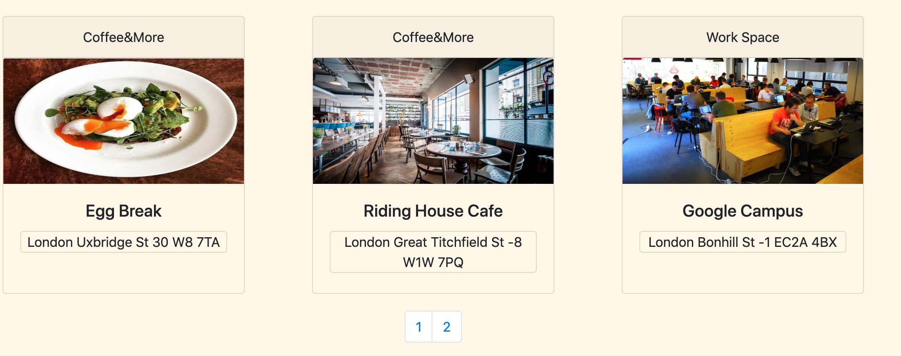
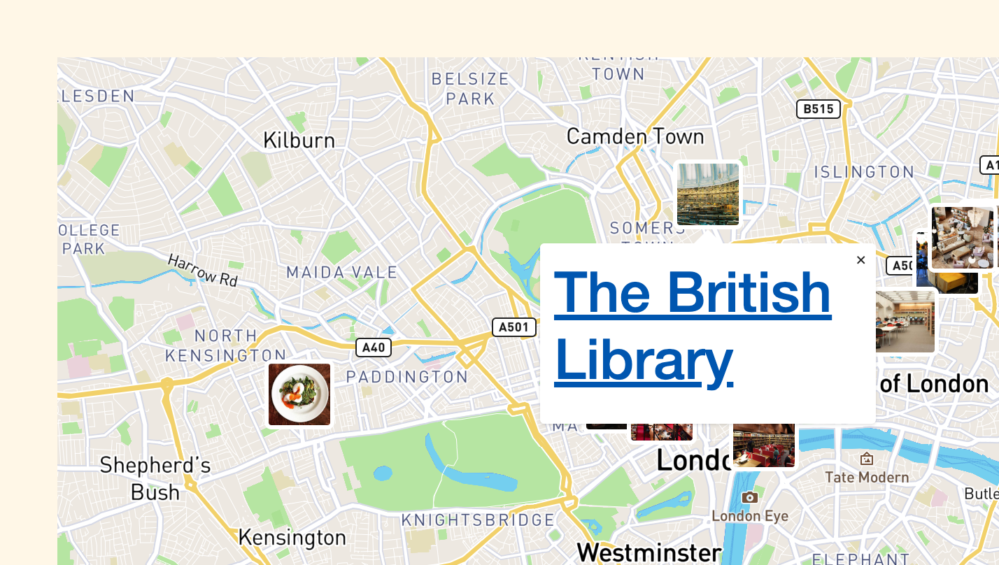
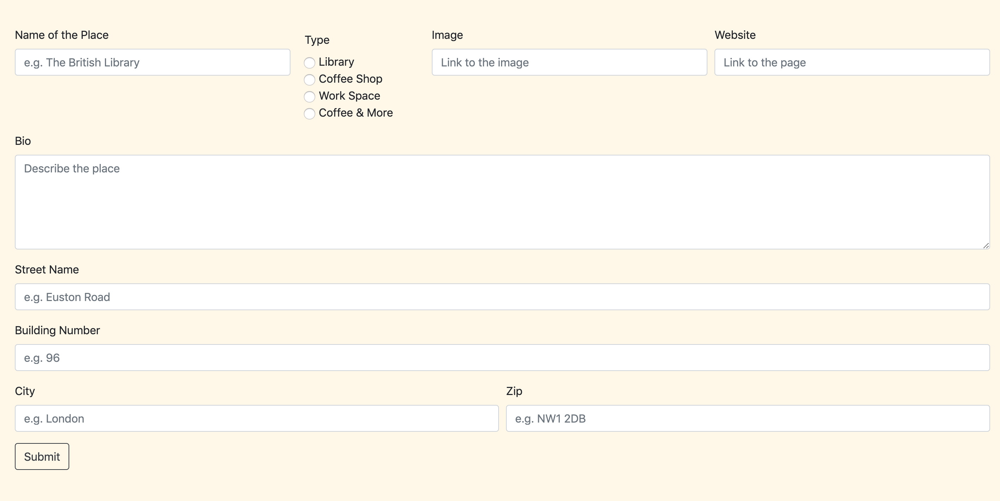

# Software Engineneering Immersive: Project 4

This is my second project during the General Assembly Software Engineering Immersive course (Week 11).
The final project was an opportunity to showcase everything we have learned so far. With the opportunity to work alone and to identify areas for self development.

# QuietPlace

I decided to create a website for people who need to find a “quiet place” to focus on their work or studies, write an essay or simply have a cup of coffee and read a book.
I pseudocode the components  I created - drew the content and made notes of any ideas I came up with during the work.  
I've decided to challenge myself and focus on Python during this project as I haven't had the opportunity to do so before. I really enjoyed working across back-end and front-end to create full-stack application.
Other technologies used in this project were React, React-Scrollable-Anchor, CSS and Bootstrap. I used Flask to provide the API framework and I tested the endpoints using Insomnia.
To make the project more visual, I used Mapbox API to mark each of the place on the map.

## Built With

The application’s backend was created using Python and Flask with a React front-end.


1. SCSS
2. Bootstrap
3. JavaScript ES6 / React.js (Framework)
4. GitHub
5. Python

## Deployment

The app is deployed on Heroku and it can be found here: https://quiet-place-sei41.herokuapp.com/

## Getting Started

Use the clone button to download the game source code. In the terminal enter the following commands:

```
<!-- to install JavaScript Packages: -->
$ yarn
<!-- to install Python packages: -->
$ pipenv
<!--Then to seed the database: -->
$ pipenv run python seeds.py
<!-- Run the frontend in your localhost: -->
$ yarn serve:front
<!-- Run the backend in your localhost: -->
$ yarn serve:back
```

## Website Architecture

### Homepage

I decided on having a one single page website, the user lands on when visiting the site.
The Homepage.js component includes five sections, Navbar and Footer. One of the sections, quiet place details is hidden, and is going to appear when the user will click on one of the places.

```js
<div className="fullPage">
  <section className="sectionOne">
    <NavbarMain />
    <h1 className="titel">Quiet Place</h1>
  </section>
  <section className="sectionTwo">
    <PlacesIndex
      places={this.state.qplaces}
      setCurrentPlace={this.setCurrentPlace}
    />
  </section>
  {this.state.currentPlaceId &&
    <ScrollableAnchor id="sectionThree">
      <section className="sectionThree">
        <PlaceDetails place={this.state.qplaces.filter(place => place.id === parseInt(this.state.currentPlaceId))[0]} />
      </section>
    </ScrollableAnchor>
  }
  <section id="map" className="sectionFour">
    <Map places={this.state.qplaces} />
  </section>
  <section className="sectionFive">
    <PlaceNew
      places={this.state.qplaces}
      getPlaces={this.getPlaces}
    />
  </section>
  <Footer />
</div>
```

---
### Quiet listings page

Once you scroll to  quiet places section, a function runs to get the data from the seeds.py file  created by myself.


I used also the pagination option from Bootstrap to limit the number of the  quiet places cards visible on the page.

```
constructor() {
  super()

  this.state = { currentPage: 1, itemsPerPage: 6 }

}
```
---

```
handlePage(e) {
  this.setState({ currentPage: e.target.textContent })
}

render() {
  const sliceStart = ((this.state.currentPage -1) * this.state.itemsPerPage)
  const sliceEnd = this.state.currentPage * this.state.itemsPerPage
  const numberOfPages = Math.ceil(this.props.places.length / this.state.itemsPerPage)
  const pagesArray = Array.from(Array(numberOfPages).keys()).map(x => ++x)
```


### Quiet Place details page


If you click on one of the cards in the quiet place listings page you are redirected to a section below with more details about the place.

In this section I added ScrollableAnchor and anonymous function to filter the places with the ID.

```
{this.state.currentPlaceId &&
  <ScrollableAnchor id="sectionThree">
    <section className="sectionThree">
      <PlaceDetails place={this.state.qplaces.filter(place => place.id === parseInt(this.state.currentPlaceId))[0]} />
    </section>
  </ScrollableAnchor>
}
```


### Map

In the fourth section we can see Map with the markers for each of the Place, when you will click on the marker you will be redirected to the Homepage of the place you are interested in.



Last section contain the New Place Form:

class Qplace(db.Model, BaseModel):

    __tablename__ = 'qplaces'

```
    name = db.Column(db.String(40), nullable=False, unique=True)
    image = db.Column(db.String(300), nullable=False)
    bio = db.Column(db.String(700), nullable=False)
    website = db.Column(db.String(300), nullable=False)
    lat = db.Column(db.Float)
    lng = db.Column(db.Float)
    creator_id = db.Column(db.Integer, db.ForeignKey('users.id'))
    creator = db.relationship('User', backref='created_qplaces')
    type_id = db.Column(db.Integer, db.ForeignKey('types.id'))
    type = db.relationship('Type', backref="qplaces")
    liked_by = db.relationship('User', secondary=likes, backref='likes')
    buildingNumber = db.Column(db.Float, nullable=False)
    street = db.Column(db.String(300), nullable=False)
    city = db.Column(db.String(300), nullable=False)
    postcode = db.Column(db.String(300), nullable=False)
```



## Future improvements


This was the first time we experienced working solo, to build fully-functioning full-stack application.


In terms of future improvements, I would like to add a search form  which is going to allow the user to perform a much more detailed search and display the places that meet the criteria of the user.

I would like to add also a authorisation for the whole page, to see the content the user has to register/login.

I would like to add a comments wall for each place to improve the user experience.
